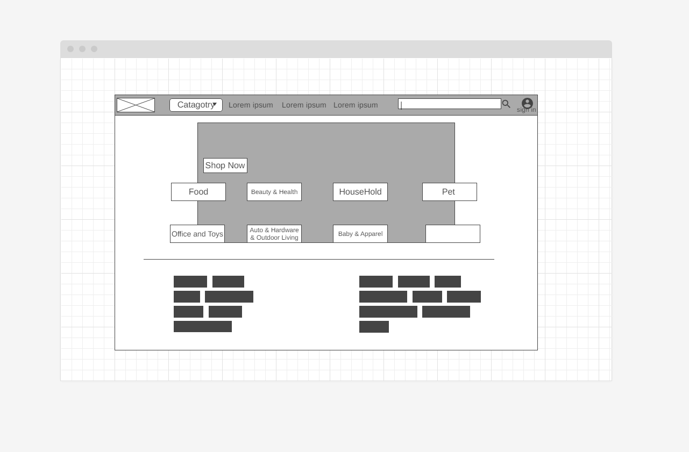

# Corey Cameron's DG-Redesign

# Links

[GitHub](https://github.com/nottmonk/DG-Redesign) | [LinkedIn](https://www.linkedin.com/in/corey-cameron-319873221/)| [Trello](https://trello.com/b/Y3IRWVsn/final-project)

## Description

I have identified several enhancements that could be made to the current Dollar General website. My goal is to enhance the overall appearance by refining the layout of specific categories, optimizing the website's speed, and improving its navigation to create a more user-friendly experience

# Technologies

1. React
2. Express
3. Heroku
4. JavaScript
5. CSS
6. GitHub
7. LucidChart

# WireFrame

## Component Hierachy Diagram

### credit

chatgpt
